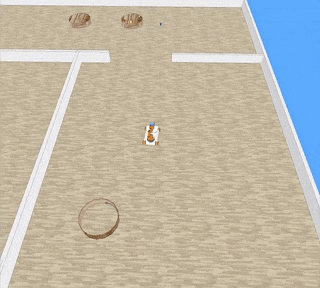

# Exercise 3: Complex Robot Trajectories and Movement Dynamics

## Overview

This exercise implements advanced movement patterns and dynamics for the YouBot platform, featuring various geometric
trajectories and velocity control mechanisms.

## Key Features

### 1. Movement Patterns

- **Basic Patterns**
    - Rectangular
    - Circular
    - Ellipsoid

- **Advanced Patterns**
    - Figure-Eight
    - Spiral
    - Star
    - Zigzag

### 2. Movement Dynamics

- Constant velocity
- Acceleration
- Deceleration
- Combined acceleration/deceleration
- Path-specific velocity adjustments

### 3. Enhanced Control Systems

- Omnidirectional movement support
- Mecanum wheel calculations
- Smooth velocity transitions
- Automatic position reset

## Movement Patterns Showcase

### Basic Patterns

- **Rectangle**: 2m x 1m paths with various speeds
- **Circle**: Configurable radius and direction
- **Ellipse**: Adjustable major/minor axes

### Complex Patterns

- **Star**: 5-point geometric pattern
- **Zigzag**: Configurable density and width
- **Figure-Eight**: Continuous infinity pattern
- **Spiral**: Expanding circular trajectory

## Usage

1. Start CoppeliaSim
2. Load scene: `scenes/movement.ttt`
3. Run: `python exercise3.py`

## Results

Successfully implemented:

- ✅ Multiple geometric patterns
- ✅ Variable movement dynamics
- ✅ Smooth transitions
- ✅ Position management
- ✅ Complex trajectory execution
