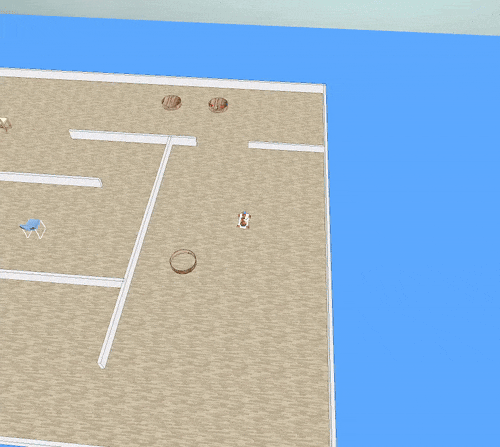

# Exercise 5: Obstacle Detection and Sensor Integration

## Overview

This exercise implements obstacle detection capabilities using the Hokuyo sensor laser beams, enabling the YouBot to
detect and respond to obstacles in its environment while performing movement patterns.

## Key Features

### 1. Sensor Integration

- Hokuyo sensor laser beam integration
- Real-time obstacle detection
- Distance threshold management
- 360° environment scanning

### 2. Obstacle Detection

- Real-time obstacle detection
- Distance-based threshold system
- Multiple obstacle tracking
- Closest obstacle identification
- Ray tracing visualization

### 3. Movement Features

- Obstacle-aware movement patterns
- Automatic movement stopping
- Safe distance maintenance
- Path adjustment capabilities

### 4. Visualization

- Real-time obstacle plotting
- Ray trace visualization
- Position and obstacle mapping
- Distance measurements display
- Environment scanning results

## Detection Capabilities

### Scanning Features

- 360° environment scanning
- Configurable scan steps
- Adjustable angle per step
- Variable scanning speed

### Movement Patterns

- Obstacle-aware forward movement
- Threshold-based stopping
- Distance monitoring
- Position tracking with obstacles

## Detection Behavior

### Scanning Process

1. Initial backward movement for safety
2. Stepwise 360° rotation
3. Continuous sensor reading
4. Obstacle data collection
5. Visualization generation

### Obstacle Response

- Stops when obstacles detected within threshold
- Generates visualization of detected obstacles
- Identifies and tracks closest obstacle
- Maintains safe distance from obstacles

## Example Operations

1. **360° Scan**
   python pattern_movement_controller.perform_360_scan(steps=100, angle_per_step=3.6, speed=5.0)
2. **Obstacle Detection Movement**
   python pattern_movement_controller.move_with_obstacle_detection(distance=5.0, speed=5.0, threshold=0.5)

## Visualization Output

### Generated Plots

- Exercise5.png: Complete 360° scan results
- Exercise5_obstacle_detection.png: Specific obstacle detection results
- Ray tracing visualization for closest obstacle

### Example Plot

*Figure 1: Example of circular pattern analysis with obstacle detection*

## Usage

1. Start CoppeliaSim
2. Load scene: `scenes/movement.ttt`
3. Run: `python exercise5.py`

## Results

Successfully implemented:

- ✅ Real-time obstacle detection
- ✅ 360° environment scanning
- ✅ Obstacle visualization
- ✅ Safe movement patterns
- ✅ Distance-based stopping
